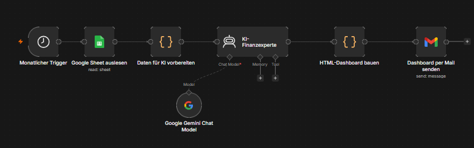
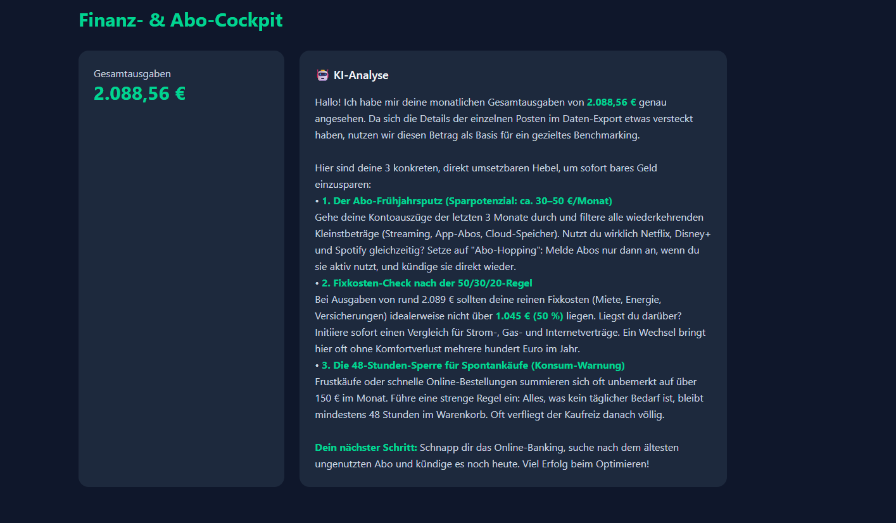

# 📊 Automatisiertes KI-Finanz- & Abo-Cockpit

Ein vollautomatisierter n8n-Workflow, der wöchentlich Finanzdaten aus einem Google Sheet ausliest, sie durch einen KI-Agenten (Google Gemini) analysieren lässt und einen interaktiven HTML-Report direkt per E-Mail versendet.

---

## 🚀 Features
* **Automatischer Trigger:** Startet zeitgesteuert einmal pro Woche.
* **Intelligente Analyse:** Extrahiert Sparpotenziale, deckt versteckte Abos auf und gibt konkrete Budget-Tipps.
* **Interaktives Dashboard:** Baut eine voll funktionsfähige HTML-Seite inklusive dynamischer Chart.js-Diagramme und modernem Tailwind CSS.
* **Krisensicherer Versand:** Das Dashboard wird direkt als handliche `.html`-Datei an die E-Mail angehängt, damit es ohne Webhook-Server lokal im Browser geöffnet werden kann.

---

## 🛠️ Workflow-Struktur

Der Workflow ist modular in n8n aufgebaut und lässt sich mit einem Klick importieren (`finance-tracker.json`):

### Genutzte Nodes:
1. **⏰ Zeitplan (Wöchentlich):** Startet den Prozess automatisch.
2. **📊 Google Sheet auslesen:** Holt die aktuellen Transaktionsdaten.
3. **⚙️ Daten für KI vorbereiten:** JavaScript-Node zur Datenbereinigung.
4. **🧠 KI-Finanzexperte (Gemini):** Generiert maßgeschneiderte Spar-Hacks.
5. **🎨 HTML-Dashboard bauen:** Erstellt das finale UI und speichert es als HTML-Binärdatei ab.
6. **✉️ Dashboard per Mail senden:** Verschickt den Report per Gmail.

---

## 📈 Das Ergebnis (Dashboard)

Wenn der Workflow durchgelaufen ist, erhält man eine E-Mail mit der angehängten Datei. Nach dem Öffnen sieht das Dashboard wie folgt aus:

---

## 🔧 Installation & Nutzung

1. Lade dir die Datei `finance-tracker.json` aus diesem Repository herunter.
2. Erstelle in n8n einen neuen Workflow und importiere die JSON-Datei per Drag-and-Drop.
3. Verknüpfe deine eigenen Credentials für **Google Sheets** und **Gmail**.
4. Setze deinen eigenen Google Gemini API-Key im Chat Model ein.
5. Klicke auf **Publish** – ab jetzt läuft dein Cockpit vollautomatisch!
