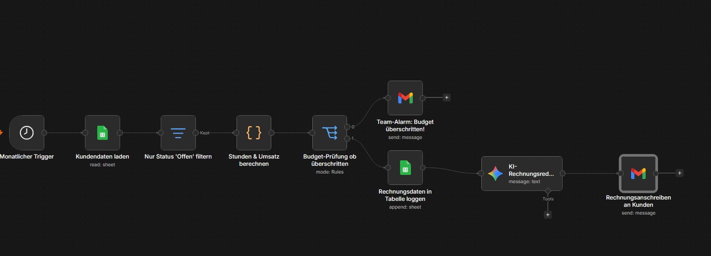
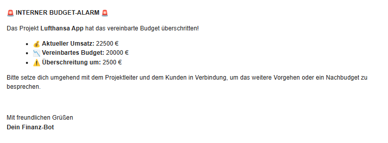
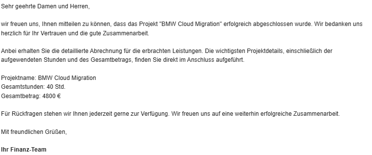

# 🧮 Automatisiertes Abrechnungs- & Controlling-System

Ein cloudbasierter n8n-Workflow für das Finanz-Controlling. Das System analysiert monatlich offene Zeiteinträge aus Google Sheets, aggregiert Stunden sowie Umsätze pro Projekt, prüft diese gegen das Projektbudget (Budget-Sicherung) und lässt eine KI (Google Gemini) hochprofessionelle Rechnungsanschreiben für Kunden formulieren.

---

## 🚀 Features
* **Automatisierter Abrechnungslauf:** Startet vollautomatisch einmal pro Monat über einen Zeitplan.
* **Stunden- & Umsatz-Aggregation:** Rechnet automatisch die geleisteten Stunden zusammen und multipliziert sie mit dem hinterlegten Stundensatz.
* **Integriertes Budget-Controlling (Switch):** Vergleicht den aktuellen Umsatz live mit dem Projektbudget.
* **Automatischer Budget-Alarm:** Sprengt ein Projekt das Budget, wird sofort eine kritische Warn-E-Mail an das interne Team ausgelöst.
* **KI-Rechnungsredakteur:** Erstellt für alle Projekte im grünen Bereich ein maßgeschneidertes, freundliches HTML-Anschreiben für den Kunden.

---

## 🛠️ Workflow-Struktur

Der gesamte Prozess ist fehlerfrei und modular in n8n aufgebaut (`kundenabrechnung.json`):

### Genutzte Nodes:
1. **⏰ Abrechnungslauf (Monatlich):** Der zeitgesteuerte Auslöser.
2. **📊 Offene Zeiteinträge laden:** Holt alle noch nicht abgerechneten Zeilen aus Google Sheets.
3. **⏳ Nur Status 'Offen' filtern:** Lässt nur unberechnete Posten durch.
4. **🧮 Stunden & Umsatz berechnen:** Berechnet via JavaScript die Summen pro Projekt.
5. **⚖️ Budget-Prüfung:** Der Lead-Verteiler (Switch-Node), der die Budgetgrenzen überwacht.
6. **📊 Rechnungsdaten loggen:** Archiviert die finalen Monatsdaten in Google Sheets.
7. **🧠 KI-Rechnungsredakteur (Gemini):** Textet das kundenfertige Anschreiben im sauberen HTML-Format.
8. **✉️ Mail-Nodes (Gmail):** Versendet entweder den internen Budget-Alarm oder das fertige Anschreiben.

---

## 🔔 Controlling & Ergebnisse

### 1. Interner Budget-Alarm (Bei Überschreitungen)
Sollte ein Projekt das vereinbarte Budget überschreiten, bricht die Rechnungsstellung ab und das Team erhält sofort diesen Alarm:

### 2. Kunden-Rechnungsanschreiben (Im grünen Bereich)
Verläuft das Projekt planmäßig im Budget, generiert die KI automatisch eine professionelle HTML-E-Mail inklusive der korrekten Summen:

---

## 🔧 Installation & Nutzung

1. Lade dir die Datei `kundenabrechnung.json` aus diesem Ordner herunter.
2. Importiere die Datei per Drag-and-Drop in dein n8n-Dashboard.
3. Verknüpfe deine Google Sheets- und Gmail-Konten (Credentials).
4. Hinterlege deinen API-Key im Google Gemini Chat Model.
5. Klicke oben rechts auf **Publish** – dein automatisiertes Controlling ist einsatzbereit!
