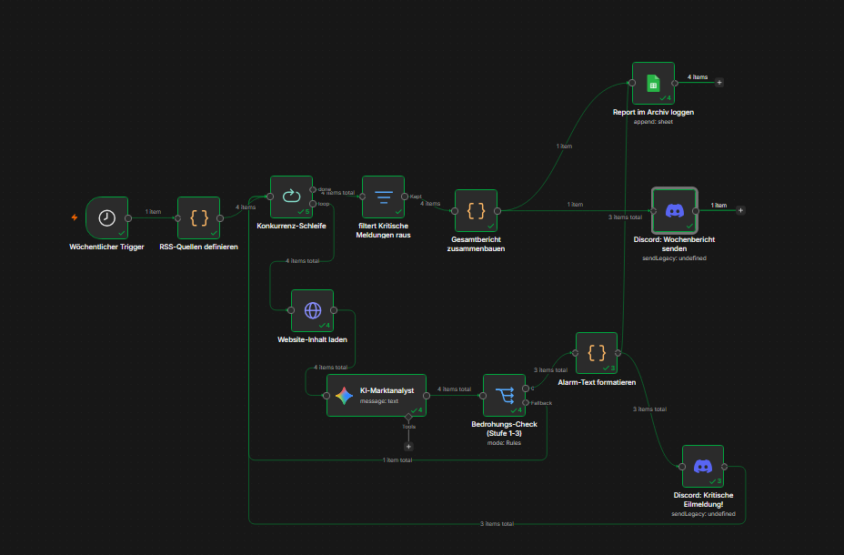
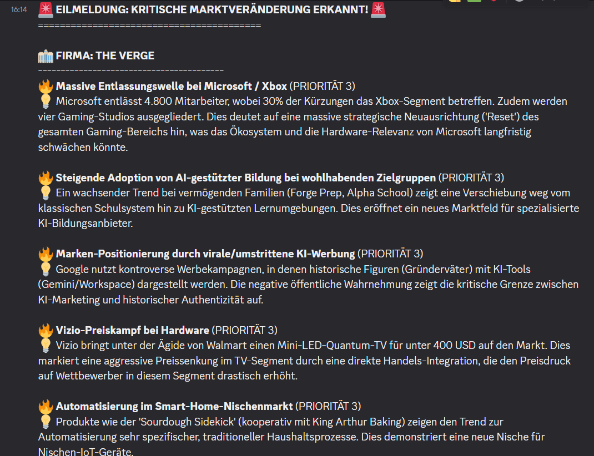
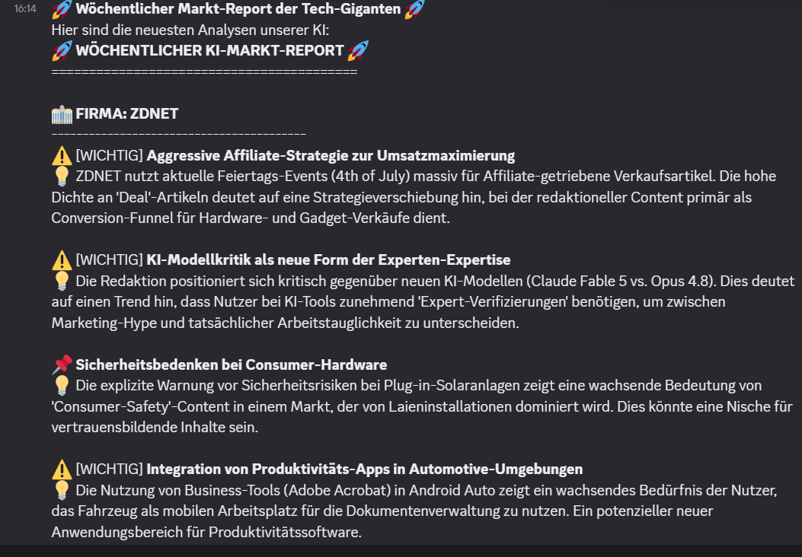

# 🌐 KI-gestützte Marktbeobachtung & Konkurrenz-Analyse

Ein vollautomatisierter n8n-Workflow zur kontinuierlichen Konkurrenzbeobachtung. Das System scannt wöchentlich die RSS-Feeds und Webseiten der wichtigsten Tech-Giganten (z. B. Apple, Google, Microsoft), bewertet die Relevanz der Neuerungen mithilfe einer KI (Google Gemini) auf einer Dringlichkeitsskala von 1 bis 3 und leitet kritische Marktveränderungen in Echtzeit weiter.

---

## 🚀 Features
* **Wöchentlicher Monitoring-Lauf:** Startet zeitgesteuert jeden Montag automatisch im Hintergrund.
* **Automatisierter Content-Feed:** Liest dynamisch definierte RSS-Feeds aus, um brandaktuelle Meldungen zu erfassen.
* **Intelligente Bedrohungs-Analyse:** Die KI filtert und bewertet Insights nach strategischer Relevanz (Stufe 1 = Info, Stufe 2 = Wichtig, Stufe 3 = Kritische Bedrohung).
* **Echtzeit-Alarmierung:** Erkennt das System eine aggressive Marktveränderung (Stufe 3), wird die Schleife priorisiert und sofort eine Eilmeldung an Discord abgesetzt.
* **Zentrales Reporting & Archivierung:** Schließt die Datenverarbeitung aller Quellen ab, baut einen strukturierten Wochenbericht, loggt diesen im Google-Sheets-Archiv und postet das Gesamtbild auf Discord.

---

## 🛠️ Workflow-Struktur

Die gesamte Pipeline ist krisensicher und modular in n8n aufgebaut (`marktanalyst.json`):

### Genutzte Nodes:
1. **⏰ Marktbeobachtung (Wöchentlich):** Der zeitgesteuerte Cron-Trigger.
2. **🌐 RSS-Quellen definieren:** Legt die zu überwachenden Firmen und URLs fest.
3. **🔄 Konkurrenz-Schleife:** Verarbeitet die Zielunternehmen nacheinander (Split-in-Batches).
4. **📰 Website-Inhalt laden:** Holt die aktuellen Daten via HTTP-Request.
5. **🧠 KI-Marktanalyst (Gemini):** Extrahiert strukturierte JSON-Insights und vergibt die Dringlichkeitsstufe.
6. **⚖️ Bedrohungs-Check (Stufe 1-3):** Ein Switch-Node zur intelligenten Routen-Verzweigung.
7. **🚨 Alarm-Text formatieren & Discord:** Baut das Eil-Layout auf und alarmiert das Team bei Stufe 3.
8. **⏳ Auf Schleifen-Ende warten & Gesamtbericht:** Führt die Daten nach Schleifenende zusammen.
9. **📊 Report im Archiv loggen:** Sichert den wöchentlichen Report dauerhaft in Google Sheets.

---

## 🔔 Benachrichtigungen & Kanäle

### 1. Kritische Eilmeldung (Echtzeit bei Stufe 3)
Sollte die KI eine akute strategische Bedrohung der Konkurrenz erkennen (z. B. aggressive Preissenkungen oder massive KI-Releases), wird dieser Alarm sofort auf Discord gepostet:

### 2. Zusammenfassender Wochenbericht (Nach Schleifen-Ende)
Sobald alle Feeds erfolgreich analysiert wurden, generiert das System eine strukturierte Gesamtübersicht für das gesamte Team:

---

## 🔧 Installation & Nutzung

1. Lade dir die Datei `marktanalyst.json` aus diesem Ordner herunter.
2. Importiere die Datei per Drag-and-Drop in deinen n8n-Editor.
3. Verknüpfe deine Credentials für **Google Sheets** und die beiden **Discord-Webhooks**.
4. Stelle sicher, dass dein API-Key im Google Gemini Chat Model hinterlegt ist.
5. Klicke oben rechts auf **Publish** – dein digitaler Marktanalyst überwacht ab jetzt das Ökosystem!
