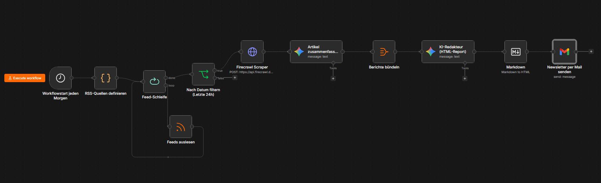
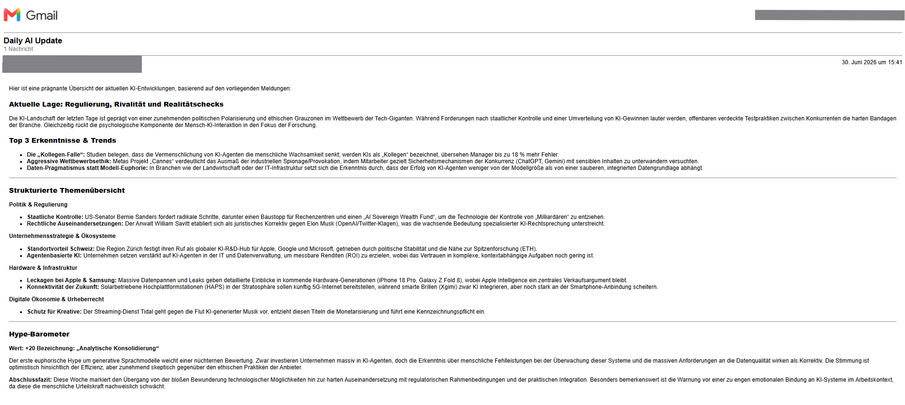

# 📰 KI-gestützter Newsletter-Agent & Content-Aggregator

Ein vollautomatisierter n8n-Workflow, der eigenständig relevante KI- und Tech-News aggregiert und redaktionell aufbereitet. Das System liest die RSS-Feeds führender Tech-Magazine (Wired, MIT Technology Review, The Verge) aus, filtert nach Aktualität, scrapt die vollständigen Artikelinhalte mittels Firecrawl und lässt eine KI (Google Gemini) eine fundierte, perfekt strukturierte HTML-Übersicht inklusive eines "Hype-Barometers" schreiben.

---

## 🚀 Features
* **Automatisierter Feed-Reader:** Holt sich zyklisch die neuesten Meldungen über definierte RSS-Schnittstellen.
* **Firecrawl-Integration:** Scrapt die hinterlegten Artikel-Links vollautomatisch und wandelt den Text in sauberes Markdown um, das die KI perfekt verarbeiten kann.
* **Intelligente Vor-Zusammenfassung:** Fasst komplexe Langform-Artikel im ersten Schritt auf 3 bis 5 prägnante Sätze zusammen.
* **KI-Redakteur (HTML-Design):** Bündelt alle Zusammenfassungen und generiert einen ansprechenden HTML-Newsletter – komplett ohne unschöne Markdown-Sternchen.
* **Eingebautes "Hype-Barometer":** Analysiert die aktuelle Marktstimmung auf einer Skala von -100 bis +100, um Trends realistisch einzuordnen.

---

## 🛠️ Workflow-Struktur

Die gesamte Pipeline läuft stabil und fehlerfrei als native n8n-Automatisierung (`newsletter-agent.json`):

### Genutzte Nodes:
1. **▶️ Manueller Start / Zeitplan:** Der Auslöser für den Newsletter-Lauf.
2. **🌐 RSS-Quellen definieren:** JavaScript-Node, der die Ziel-Feeds (Wired, Verge, Tech Review) verwaltet.
3. **🔄 Feed-Schleife:** Iteriert strukturiert durch alle gefundenen Artikel (Split-in-Batches).
4. **📰 Feeds auslesen:** Extrahiert Titel, Links und Veröffentlichungsdaten.
5. **⏳ Nach Datum filtern (Letzte 24h):** Sortiert ältere Beiträge rigoros aus.
6. **🔥 Firecrawl Scraper:** Liest den vollen Inhalt der qualifizierten Artikel aus.
7. **🧠 Artikel zusammenfassen:** Gemini 2.5 Flash erstellt kompakte Kurzberichte.
8. **📦 Berichte bündeln:** Der Aggregate-Node sammelt alle Einzelberichte für das Finale.
9. **✍️ KI-Redakteur (HTML-Report):** Gemini erstellt die finale, designte Übersicht.
10. **✉️ Newsletter per Mail senden:** Gmail verschickt das fertige HTML-Layout direkt an das Postfach.

---

## 📈 Das Ergebnis (Newsletter-Layout)

Der finale Newsletter kommt als sauber formatierte E-Mail mit klarer Struktur, optischen Highlights für die Top-Trends und dem visuellen Hype-Barometer an:

---

## 🔧 Installation & Nutzung

1. Lade dir die Datei `newsletter-agent.json` aus diesem Ordner herunter.
2. Importiere sie einfach per Drag-and-Drop in dein n8n-Dashboard.
3. Hinterlege deine API-Credentials für **Firecrawl** (im HTTP-Request Node), **Google Gemini** und **Gmail**.
4. Passe die Empfänger-E-Mail-Adresse im Gmail-Node an.
5. Klicke auf **Publish** – dein persönlicher KI-Redakteur versorgt dich ab jetzt regelmäßig mit den wichtigsten Tech-Insights!
