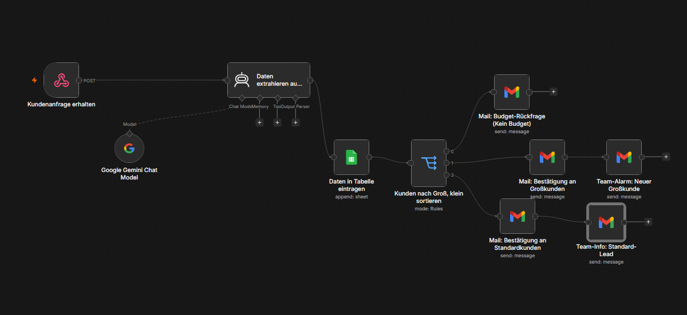
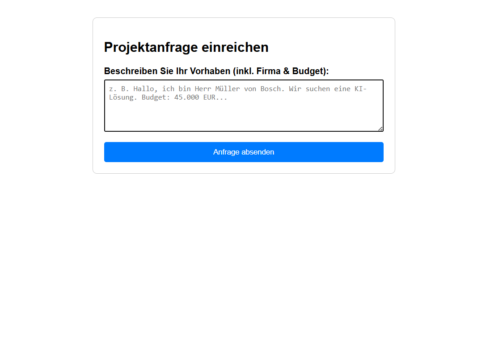

# 📥 Automatisiertes Webformular mit KI-Lead-Qualifizierung

Ein intelligentes, end-to-end System zur Erfassung und automatischen Filterung von B2B-Kundenanfragen. Eingehende Leads aus einem interaktiven HTML-Webformular werden in Echtzeit per Webhook an n8n übergeben. Eine KI (Google Gemini) analysiert die Freitexte, extrahiert strukturiert Firmennamen sowie Budgets und leitet die Anfragen vollautomatisch in passgenaue Vertriebs- und CRM-Prozesse weiter.

---

## 🚀 Features
* **Interaktives Webformular:** Ein modernes, cleanes HTML-Eingabeformular (`Webformular.html`) für potenzielle Kunden.
* **Echtzeit-Verarbeitung:** Sofortige Datenübertragung an den n8n-Zentral-Server via HTTP-POST-Webhook.
* **Intelligente KI-Extraktion:** Gemini analysiert das Textfeld der Anfrage, zieht den Firmennamen heraus und isoliert das Budget als reine, kalkulierbare Zahl.
* **Robuster Daten-Parser:** Ein integrierter JavaScript-Node putzt die KI-Antworten und bereitet sie fehlerfrei für nachfolgende Systeme vor.
* **Automatisiertes CRM-Logging:** Protokolliert jeden Lead mit Zeitstempel, Name und Budget direkt in ein Google Sheet.
* **Drei-Wege-Lead-Verteiler (Switch):** 1. *Kein Budget angegeben:* Löst eine automatische Rückfrage-Mail an den Kunden aus.
  2. *Standard-Kunde:* Sendet eine normale Bestätigung und informiert das Vertriebsteam.
  3. *Großkunde (VIP):* Löst internen Prioritäts-Alarm aus und versendet eine exklusive Bestätigung der Geschäftsleitung.

---

## 🛠️ Workflow-Struktur

Die gesamte Pipeline ist krisensicher und modular in n8n aufgebaut (`webformular-filter.json`):

### Genutzte Nodes:
1. **📥 Webformular-Eingang (Webhook):** Der Live-Endpunkt für das HTML-Formular.
2. **🧠 KI Lead-Analyst (Gemini):** Extrahiert strukturierte JSON-Daten aus dem Anfrage-Text.
3. **⚙️ KI-Daten sauber parsen:** JavaScript-Node zur finalen Validierung und Bereinigung.
4. **📊 CRM Google Sheet loggen:** Protokolliert die Leads zeilenweise im Archiv.
5. **🔀 Lead-Verteiler (Switch):** Sortiert die Anfragen anhand der Budgetgrenzen.
6. **✉️ Mail-Kanäle (Gmail):** Versendet maßgeschneiderte Antworten an Kunden und Benachrichtigungen an das Team.

---

## 💻 Das Webformular (Frontend)

Die Anfragen starten auf einer minimalistisch designten Benutzeroberfläche, die direkt an die n8n-Infrastruktur gekoppelt ist:

---

## 🔧 Installation & Nutzung

1. Lade dir die Dateien `webformular-filter.json` und `Webformular.html` herunter.
2. Importiere die JSON-Datei per Drag-and-Drop in dein n8n-Dashboard.
3. Kopiere die generierte **Production Webhook URL** aus deinem n8n-Eingangs-Node.
4. Öffne `Webformular.html` in einem Texteditor und setze deine Webhook-URL im `action`-Attribut des Formulars ein.
5. Verknüpfe deine Google Sheets- und Gmail-Konten im Workflow und klicke oben rechts auf **Publish** – dein intelligentes CRM-System ist live!
